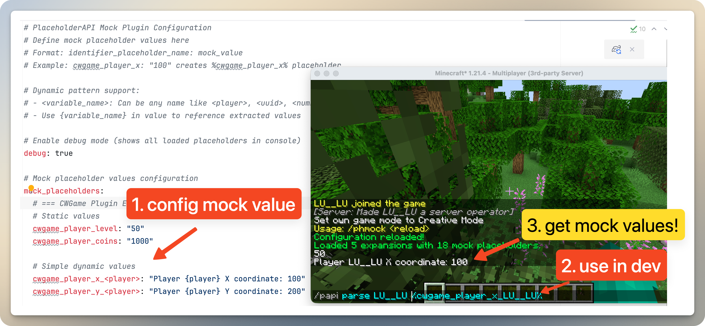

# PlaceholderAPI Mock Plugin

## ⚠️ DEVELOPMENT ONLY - DO NOT USE IN PRODUCTION

**This plugin is designed exclusively for development and testing environments. It should NEVER be used on production servers.**

## Overview

PlaceholderAPI Mock is a Spigot plugin that provides mock placeholder values for developers working on plugins that depend on PlaceholderAPI. Instead of setting up complex plugin ecosystems during development, you can quickly mock any placeholder values through simple configuration.

This plugin is perfect for:
- Plugin developers who need to test PlaceholderAPI integrations
- Multi-developer teams where not everyone needs full plugin setups
- Testing scenarios where you need predictable placeholder values
- Development environments where installing multiple plugins is impractical



## Features

- **Easy Configuration**: Define mock placeholders through a simple YAML configuration
- **Dynamic Placeholder Support**: Support for placeholders with dynamic parameters (e.g., `%plugin_player_<player>%`)
- **Multiple Identifiers**: Mock placeholders from multiple different plugins simultaneously
- **Runtime Reloading**: Reload configuration without restarting the server
- **Debug Mode**: See all loaded mock placeholders in console for debugging

## Requirements

- **Spigot/Paper 1.21+**
- **PlaceholderAPI** (required dependency)
- **Java 17+**

## Installation

1. Download the latest release from the releases page
2. Place the JAR file in your server's `plugins/` folder
3. Make sure **PlaceholderAPI** is installed and enabled
4. Start your server
5. Configure mock placeholders in `plugins/PlaceholderAPIMock/config.yml`
6. Reload the plugin with `/papimock reload`

## Configuration

The plugin configuration is located at `plugins/PlaceholderAPIMock/config.yml`.

### Basic Structure

```yaml
# Enable debug mode (shows all loaded placeholders in console)
debug: true

# Mock placeholder values configuration
mock_placeholders:
  # Static placeholders
  plugin_identifier_placeholder_name: "mock_value"
  
  # Dynamic placeholders with variables
  plugin_identifier_<variable>: "Value with {variable}"
```

### Configuration Examples

#### Static Placeholders
```yaml
mock_placeholders:
  # Economy plugin examples
  vault_eco_balance: "9999999.99"
  vault_eco_top_1: "RichPlayer123"
  
  # Player data examples
  playerdata_level: "50"
  playerdata_exp: "1500"
```

#### Dynamic Placeholders
```yaml
mock_placeholders:
  # Single variable
  vault_eco_balance_<player>: "Player {player} balance: 50000"
  
  # Multiple variables
  gamedata_player_<player>_<type>: "Player {player} {type}: 100"
  
  # Complex patterns
  stats_top_<rank>_<category>: "Rank {rank} in {category}: PlayerName"
```

### Variable Types

You can use any variable name in angle brackets `<variable_name>`:
- `<player>` - Player name
- `<uuid>` - Player UUID  
- `<world>` - World name
- `<rank>`, `<number>`, `<type>` - Any custom identifier

Use `{variable_name}` in the value to reference the extracted variable.

## Commands

| Command | Permission | Description |
|---------|------------|-------------|
| `/papimock reload` | `placeholdermock.admin` | Reload the plugin configuration |

**Note**: The permission `placeholdermock.admin` defaults to OP players.

## Usage Examples

### For Economy Plugin Development
```yaml
mock_placeholders:
  vault_eco_balance: "1000000"
  vault_eco_balance_<player>: "{player} has $50,000"
  vault_eco_top_1: "WealthyPlayer"
  vault_eco_top_<rank>: "Player{rank}"
```

Test with: `%vault_eco_balance%`, `%vault_eco_balance_Steve%`, `%vault_eco_top_1%`

### For Custom Plugin Development
```yaml
mock_placeholders:
  myplugin_player_level: "25"
  myplugin_player_<player>_exp: "Player {player} has 1500 EXP"
  myplugin_guild_<guild>_members: "Guild {guild} has 15 members"
```

Test with: `%myplugin_player_level%`, `%myplugin_player_Steve_exp%`, `%myplugin_guild_Warriors_members%`

## Development Workflow

1. **Setup**: Install PlaceholderAPI and PlaceholderAPI Mock on your test server
2. **Configure**: Add mock placeholders for the plugins you're developing against
3. **Test**: Use the mocked placeholders in your plugin development
4. **Iterate**: Modify mock values and reload with `/papimock reload` as needed
5. **Deploy**: Remove this plugin before deploying to production

## Troubleshooting

### Plugin Not Loading
- Ensure PlaceholderAPI is installed and enabled first
- Check console for error messages
- Verify you're running Spigot/Paper 1.21+

### Placeholders Not Working
- Use `/papimock reload` after configuration changes
- Enable `debug: true` to see loaded placeholders in console
- Check placeholder syntax matches your configuration exactly
- Ensure placeholder identifiers match what you're testing

### Permission Issues
- Default permission is OP-only
- Grant `placeholdermock.admin` to users who need to reload config

## Important Warnings

### 🚨 DO NOT USE IN PRODUCTION

This plugin is designed for development only. Using it in production can:
- Provide fake data to players
- Interfere with real plugin functionality  
- Cause confusion and unexpected behavior
- Lead to data inconsistencies

### Development Best Practices

- Keep separate development and production server configurations
- Document which placeholders you're mocking for your team
- Test with real plugins before production deployment
- Remove all mock configurations before going live

## Support

This plugin is provided as-is for development purposes. For issues:

1. Check your configuration syntax
2. Verify PlaceholderAPI is working correctly
3. Enable debug mode to diagnose problems
4. Check server console for error messages

## License

This project is licensed under the MIT License - see the LICENSE file for details.

---

**Remember: This plugin is for development and testing only. Always use real plugins in production environments.** 